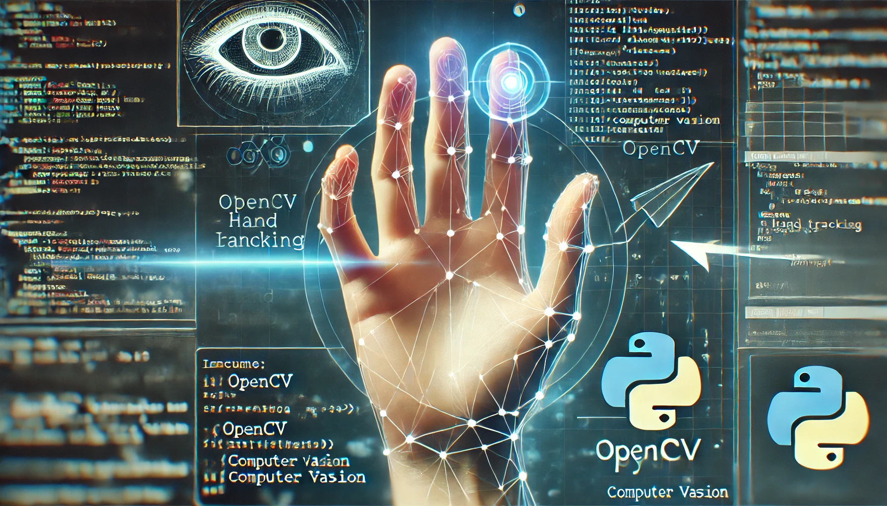

<div style="text-align: center;">
    
</div>


# AI-Virtual-Mouse

## Overview

The AI-Virtual-Mouse project leverages computer vision and AI to create a virtual mouse controlled by hand gestures. Utilizing a webcam, the system tracks hand movements, interprets gestures, and performs mouse operations like moving the cursor and clicking, providing a touchless interface for interacting with a computer.

## Features

- Hand tracking using a webcam
- Gesture recognition for mouse movement and clicking
- Smooth and responsive cursor control
- Touchless interface for improved user interaction

## Installation

1. Clone the repository:
    ```bash
    git clone https://github.com/HoomKh/AI-Virtual-Mouse.git
    ```
2. Navigate to the project directory:
    ```bash
    cd AI-Virtual-Mouse
    ```
3. Install the required dependencies:
    ```bash
    pip install -r requirements.txt
    ```

## Usage

1. Ensure your webcam is connected and working.
2. Run the main script:
    ```bash
    python Ai_Virtual_Mouse_Project.py
    ```
3. The system will start capturing video from the webcam and tracking your hand movements.

## Dependencies

- OpenCV
- NumPy
- PyAutoGUI
- Mediapipe (for hand tracking)
- Time (standard Python library)

## Project Structure

- `Ai_Virtual_Mouse_Project.py`: Main script to run the virtual mouse.
- `HandTrackingModule.py`: Module for hand tracking and gesture recognition.
- `requirements.txt`: List of required Python packages.

## How It Works

1. **Hand Tracking**: The system uses a webcam to capture video and detect hand landmarks using the Mediapipe library.
2. **Gesture Recognition**: Specific hand gestures (e.g., index finger up for moving, both index and middle fingers up for clicking) are recognized and interpreted.
3. **Mouse Control**: The recognized gestures are mapped to mouse actions using PyAutoGUI, allowing you to control the cursor and perform clicks.

## Contributing

Contributions are welcome! Please feel free to submit a Pull Request.

## License

This project is licensed under the MIT License.

## Contact

Created by [HoomKh](https://github.com/HoomKh) - feel free to contact me!

---

Thank you for checking out AI-Virtual-Mouse! If you have any questions or feedback, please open an issue on GitHub.
